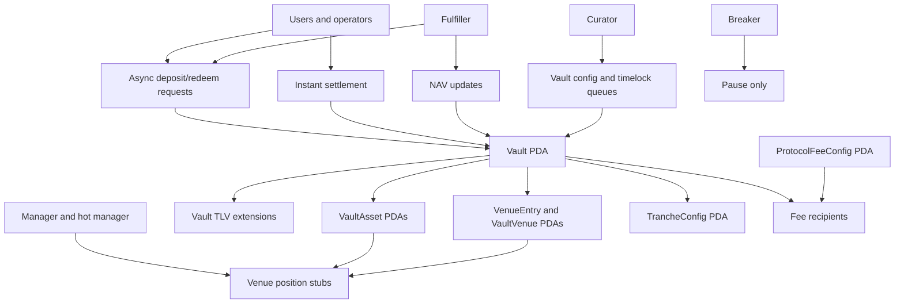

# Solana Vault V2

[](LICENSE)
[](https://www.anchor-lang.com/)

Solana Vault V2 is an experimental, MIT-licensed community fork of
[solana-foundation/vault](https://github.com/solana-foundation/vault). It keeps
the upstream async vault model, then adds a broader control surface for
role-separated operations, stricter NAV-based settlement, multi-asset accounting
scaffolding, venue approval metadata, tranche accounting, instant settlement,
and protocol fee splits with an optional program-level recipient config.

> Reference implementation only. This fork is unaudited, not deployed to
> mainnet-beta, and not ready for production funds.

## Why This Exists

The upstream Solana Foundation vault program provides a compact single-asset
async vault with Token-2022 compatibility, TLV extensions, request queues,
deposit/withdrawal fees, and authority-controlled NAV updates. V2 explores what
a more operational vault stack could look like while preserving that base model.

The current implementation focuses on testable on-chain primitives:

- separate curator, manager, hot-manager, fulfiller, and breaker roles
- fresh-NAV settlement and bounded NAV update checks
- deposit caps and rolling-limit buckets
- timelocked vault, fee, and mutable TLV extension changes
- approved secondary-asset records and per-asset ledgers
- externally managed withdrawal opt-in and venue approval metadata
- constrained SPL token-account position stubs
- senior/junior tranche accounting and tranche-scoped async requests
- primary-asset instant deposit/redeem flows
- vault-level protocol fee bps with optional program-level recipient routing

This fork is not an official Solana Foundation release and does not imply
Solana Foundation endorsement.

## Architecture

At a high level, V2 is still an Anchor program centered on one `Vault` PDA per
share mint. Optional capabilities are layered through typed PDAs and TLV
extensions instead of one large always-on account graph.



### Core Accounts

- `Vault`: primary configuration, roles, NAV state, accounting counters, fee
  settings, rolling-limit buckets, and links to optional state.
- `Request`: async deposit/redeem lifecycle account, now asset and share-mint
  scoped for V2 flows.
- `VaultAsset`: approved secondary asset metadata plus per-asset reserve,
  pending, idle, deployed, and cap accounting.
- `VenueEntry` and `VaultVenue`: venue registry metadata, per-vault approval
  state, and approved withdrawal recipient authority. These do not execute
  arbitrary CPI yet.
- `Position`: constrained SPL token-account custody stub for manager deploy/pull
  tests.
- `TrancheConfig`: senior/junior share-mint config, NAV snapshots, request
  limits, FIFO lane counters, and junior-ratio guard data.
- `PendingVaultUpdate`, `PendingFeeUpdate`, `PendingExtensionUpdate`: typed
  timelock queues for delayed config changes.
- `InstantSettlementUser`: optional per-user instant settlement rolling-limit
  bucket.
- `ProtocolFeeConfig`: singleton program-level recipient override for protocol
  fee token accounts. Vault-level `protocol_fee_recipient` remains the fallback.

### Program Shape

- Program name: `async_vault_v2`
- Local/test program ID: `3Y4rpSYqrW9JRuiS3YosEXSSYHai4sFH3XMzAQmkNzFg`
- IDL: [idl/async_vault_v2.json](idl/async_vault_v2.json)
- Rust client: [clients/rust/async_vault_v2](clients/rust/async_vault_v2)

## Implementation Status

Implemented or partially implemented:

- Phase 0 fork baseline, rename, clients, IDL, program ID, and provenance docs.
- Phase 1 roles, fresh NAV, NAV bounds, deposit caps, rolling limits,
  timelocks, fee queues, performance fees, protocol fee splits, and singleton
  protocol fee recipient routing.
- Phase 2 approved secondary-asset PDAs, request unwind paths, and fail-closed
  secondary approvals until USD-normalized pricing exists.
- Phase 3 externally managed withdrawal opt-in, venue metadata, per-vault venue
  approvals, and constrained position stubs.
- Phase 4 tranche config, waterfall accounting, tranche-scoped requests,
  request bounds, junior-ratio guards, lane-local FIFO queue counters, and
  tranche/performance-fee incompatibility guards.
- Phase 5 primary-asset, non-tranche instant deposit/redeem with mandatory NAV
  staleness plus instant-redemption-fee guards and optional per-transaction and
  per-user limits.

Not implemented yet:

- USD-normalized multi-asset NAV
- oracle adapters and oracle-backed NAV validation
- validated arbitrary venue CPI execution
- external protocol custody accounting
- vault-in-vault cycle prevention
- secondary-asset or tranche-aware instant settlement
- tranche-aware performance fees and high-water marks
- program-wide protocol fee bps override and authority-transfer policy

See [docs/SPEC_COVERAGE.md](docs/SPEC_COVERAGE.md) for the requirement-by-
requirement coverage table.

## Quickstart

### Prerequisites

- Rust, using [rust-toolchain.toml](rust-toolchain.toml)
- Node.js and pnpm
- Solana CLI 3.1.14
- Anchor CLI 1.0.2

### Build And Test

```bash
just install
just build
just test
just check
```

Useful direct commands:

```bash
anchor build --ignore-keys
pnpm run generate-clients
cargo test -p async_vault_v2 -p vault_common
cargo test -p integration-tests
```

## Documentation

- [Build Report](REPORT.md)
- [Design Decisions](DESIGN_DECISIONS.md)
- [Account Layout](docs/ACCOUNTS.md)
- [Integration Mapping](docs/INTEGRATION.md)
- [Spec Coverage](docs/SPEC_COVERAGE.md)
- [Upstream Test Map](docs/UPSTREAM_TEST_MAP.md)
- [Sequence Diagrams](programs/async_vault_v2/docs/SEQUENCES.md)
- [Security Policy](SECURITY.md)

## Verification Snapshot

The latest local verification pass for this snapshot included:

- `anchor build --ignore-keys`
- `cargo test -p async_vault_v2 -p vault_common`
- `cargo test -p integration-tests`
- `cargo clippy -p async_vault_v2 -p vault_common -p integration-tests -- -D warnings`
- `cargo +nightly fmt -p async_vault_v2 -p vault_common -p integration-tests -p async-vault-v2-client -- --check`
- `pnpm run format:check`
- `pnpm lint`
- `pnpm run typecheck`

The upstream audit does not cover V2 changes. See [AUDIT_STATUS.md](AUDIT_STATUS.md)
and [REPORT.md](REPORT.md) for details and known gaps.

## Attribution

This repository is forked from
[solana-foundation/vault](https://github.com/solana-foundation/vault) at commit
`c667cf8079d90f79fc0daf32d332a3693b37e6c6`.

The upstream Cantina APEX report is copied at
[audits/apex-scan-june-22-2026.pdf](audits/apex-scan-june-22-2026.pdf), and the
audited-through upstream commit is
`ce2b5483de53cd015efbbdea70ecec75d976bb08`.

## License

MIT. See [LICENSE](LICENSE) and [NOTICE](NOTICE).
