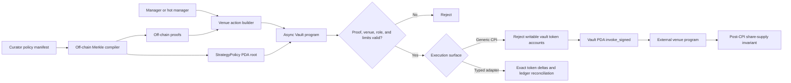

# Merkle Strategy Policy

## Purpose

The Merkle strategy policy is an opt-in authorization boundary for manager and hot-manager
venue calls. A strategist can execute only CPI shapes committed by the curator in an on-chain
Merkle root. The full capability manifest and proofs remain off-chain.

This design translates two Veda patterns to Solana:

- the EVM manager stores a root per strategist and verifies every managed call before the vault
  signs it; and
- the SVM manager derives a digest from selected instruction bytes and accounts before a
  vault-signed CPI.

The policy is additive. Existing vaults, TLV extensions, venue positions, deposits, redemptions,
and externally managed withdrawals retain their current behavior.

## Trust boundary



The curator remains trusted to construct a safe policy. The strategist, proof service, RPC,
transaction builder, and target-program inputs are untrusted at execution time. A valid proof
does not bypass vault pause, venue pause, role, rolling-limit, or share-supply checks.

## Accounts

`StrategyPolicy` is a separate PDA so existing `Vault` account and TLV layouts do not migrate:

```text
seeds = ["strategy_policy", vault, strategist]

vault
strategist
merkle_root
version
paused
executing
bump
```

`PendingStrategyPolicyUpdate` follows the existing caller-created timelock account pattern. It
stores the queued curator, ETA, expected current version, next root, and next paused state.

## Policy lifecycle

1. The curator initializes a disabled policy with a zero root and `paused = true`.
2. Without a vault timelock, the curator may update the root immediately.
3. With a vault timelock, the curator queues an update and anyone may execute it after the ETA.
4. Every applied update increments the policy version. A queued update is rejected if its
   expected version is stale.
5. The curator or breaker may pause a policy immediately. Pause increments the version, invalidating
   existing proofs and any previously queued update. Only a newly queued or immediate normal update
   may unpause it.
6. The curator may close a policy to revoke it and recover rent.

## Canonical leaf

Leaves use Solana SHA-256 and fixed domain separation:

```text
leaf = SHA256(
    LEAF_DOMAIN
    || async_vault_program_id
    || vault
    || strategist
    || policy_version_le
    || target_program
    || instruction_discriminator_8
    || instruction_data_length_le
    || cpi_account_count_le
    || operator_count
    || apply(operators)
)
```

The target program, eight-byte discriminator, instruction length, and CPI account count are
always committed. Operators add the security-sensitive parts of the call:

- `IngestInstruction { offset, length }` commits a checked byte range from instruction data.
- `IngestAccount { index }` commits an ordered account public key and its effective CPI signer
  and writable flags.
- `ManagerLimitAmount { offset }` parses a little-endian `u64` from instruction data for the
  existing manager rolling limit without fixing that value in the leaf.

Operator tags and operands are themselves committed before extracted values. The program caps
operator count and cumulative ingested instruction bytes, and rejects zero-length or out-of-bounds
ranges, account-index overflows, duplicate amount operators, oversized instructions, too many CPI
accounts, and excessive proof depth.

For the safest exact-call policy, ingest every instruction byte after the discriminator and every
account. Selective ingestion is intended for audited protocol templates where dynamic fields such
as amounts must remain variable.

The vault PDA is normalized to an effective CPI signer and read-only authority before account
metadata is hashed. Thus the leaf commits the privileges the external program actually receives,
rather than only the outer transaction flags. Other accounts retain their effective outer-transaction
privileges.

## Tree and proof

Leaves are sorted lexicographically. An odd final node is duplicated. Internal nodes use sorted
pairs so proofs do not require direction bits:

```text
parent = SHA256(NODE_DOMAIN || min(left, right) || max(left, right))
```

The on-chain verifier caps proof depth at 12, supporting up to 4,096 leaves while bounding compute
and instruction data. In practice Solana's 1,232-byte transaction limit will constrain account-heavy
venue calls before that leaf count is reached. Both shipped client helpers reject larger trees.

## Venue execution flow

`manage_vault_with_merkle_verification` performs one external CPI:

1. Validate the vault is initialized and unpaused.
2. Validate the canonical policy PDA for the signing strategist.
3. Require the policy version, nonzero root, active state, and non-reentrant state.
4. Apply the existing manager/hot-manager and routine-safe venue authorization.
5. Validate active `VenueEntry` and `VaultVenue` records and three-way target-program equality.
6. Require an executable, non-self target and an approved eight-byte venue discriminator.
7. Normalize CPI account privileges, apply bounded operators, and reconstruct the leaf.
8. Verify the Merkle proof against the stored root.
9. Reject the generic path if any writable SPL Token or Token-2022 account is controlled by the
   vault PDA; custody movement must use a typed adapter.
10. Apply the amount selected by `ManagerLimitAmount` to the existing manager rolling limit.
11. Snapshot share-mint supply.
12. Invoke the target program with the vault PDA as the only program-derived signer.
13. Reload the share mint and require supply to remain constant.
14. Emit the policy version, leaf, target program, and account count.

Solana transaction atomicity rolls back both the CPI and policy/limit state if any post-CPI check
fails. The program flushes the policy reentrancy flag and any consumed rolling-limit state before
the CPI so a callback observes both guards rather than Anchor's pre-exit in-memory values.

## Security properties and non-goals

The extension prevents a compromised manager key from changing the target program, selector,
committed accounts, committed data, or account privileges without a matching proof. Vault, policy
version, and strategist binding prevent cross-vault and cross-policy proof replay.

It does not:

- prove that an approved or upgradeable venue program is economically safe;
- update protocol-specific `Position` or multi-asset accounting after arbitrary CPI;
- infer which dynamic field represents economic exposure without a `ManagerLimitAmount` operator;
- make a poorly constructed curator policy safe; or
- remove Solana transaction-size, compute-budget, or CPI-depth constraints.

The shipped `manage_vault_with_token_balance_adapter` is the first typed reference adapter. It uses
a separately domain-separated leaf that binds the canonical reserve, `Position`, position token
account, asset mint, action, venue records, and per-call maximum. It permits a dynamic amount only
when `0 < amount <= policy_max_amount`, verifies exact opposing token-account deltas, reconciles
primary or secondary ledgers, and preserves share supply. It does not call a lending market, AMM,
or other external strategy.

Further protocol adapters should layer semantic validation and post-CPI balance accounting on top
of this authorization primitive. Account-heavy integrations may prefer a two-step permit PDA or
Veda SVM's per-digest PDA model when proof bytes do not fit comfortably in one transaction. See
[`STRATEGY_ADAPTERS.md`](STRATEGY_ADAPTERS.md) for the adapter leaf and extension checklist.

## Verification matrix

The current unit and LiteSVM suites cover:

- deterministic leaf/node hashing, sorted-pair proofs, single/odd-leaf trees, depth bounds, checked
  operator ranges, dynamic amount parsing, privilege binding, and cumulative ingestion bounds;
- policy initialization, immediate activation, timelocked root rotation, and immediate pause;
- stale queued-update invalidation on emergency pause and pending-update cleanup after policy close;
- rejection when a committed CPI account is changed;
- rejection when generic CPI attempts to write a vault-owned token account;
- typed primary deploy/pull with exact reserve, position, stored-ledger, and rolling-limit updates;
- typed secondary deploy/pull with `VaultAsset` idle/deployed and per-asset limit reconciliation;
- adapter per-call maximum, declared-maximum proof binding, cumulative rolling-limit, and stale-ledger
  failures;
- rollback when an otherwise valid SPL Token CPI changes share supply;
- rejection of managed calls and policy mutation while the execution guard is set; and
- shared generic and typed-adapter golden vectors in the Rust and TypeScript helpers.

## Primary inspiration

- [Veda EVM `ManagerWithMerkleVerification.sol`](https://github.com/Veda-Labs/boring-vault-plasma/blob/main/src/base/Roles/ManagerWithMerkleVerification.sol)
- [Veda SVM program](https://github.com/Veda-Labs/boring-vault-svm/blob/main/programs/boring-vault-svm/src/lib.rs)
  and [`utils/operators.rs`](https://github.com/Veda-Labs/boring-vault-svm/blob/main/programs/boring-vault-svm/src/utils/operators.rs)
- [Veda Manager architecture](https://docs.veda.tech/architecture-and-flow-of-funds/manager) and
  [smart-contract security](https://docs.veda.tech/security-and-risk-controls/smart-contract-security)

The encoding above is intentionally Solana-specific and is not byte-compatible with Veda's EVM
Merkle tree.
