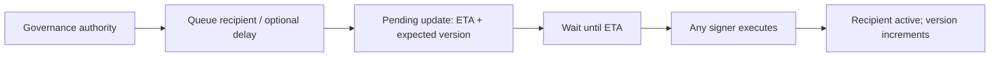

# Protocol Fee Governance

The program-level protocol-fee recipient is an optional override. Each vault
still owns its `protocol_fee_bps` and fallback `protocol_fee_recipient`; the
singleton changes only recipient routing when callers supply it to a fee path.

## Secure bootstrap

1. Deploy the program under the upgradeable loader.
2. The current program upgrade authority calls
   `initialize_protocol_fee_config_v2`, selecting a governance authority,
   breaker, and nonzero delay.
3. The instruction creates `ProtocolFeeConfig`, or securely adopts an existing
   legacy account, and creates its `ProtocolFeeGovernance` sidecar. Bootstrap
   always overwrites the config into a paused state with the default recipient,
   so legacy authority/recipient data cannot remain active.
4. The governance authority queues the first recipient with
   `queue_protocol_fee_config_update`.
5. After `eta_slot`, any signer may execute it with
   `execute_protocol_fee_config_update`.

Run bootstrap before making the program immutable if the singleton will be
used. An immutable program with no existing config remains safely on each
vault's local recipient and cannot create the global override.

The legacy initialize and direct-update instructions are intentionally disabled
while keeping their discriminators, so old clients receive an explicit error
instead of bypassing the new controls.

## Recipient rotation

The queued authority and governance version must still match at execution. A
pause or an accepted authority transfer increments the version and makes older
pending work stale. The current authority can cancel a pending update at any
time.

## Emergency pause

The current governance authority or breaker may call
`pause_protocol_fee_config` without waiting. It clears the global recipient,
sets `paused = true`, and increments the version. Fee paths that receive the
paused singleton consume it normally but route to the vault-local fallback.

Reactivation is deliberately delayed: queue a non-default recipient and execute
it after the configured ETA.

## Authority transfer

1. Current authority queues a non-default successor.
2. The transfer records the current authority, ETA, and governance version.
3. After the ETA, only the named successor can accept.
4. Acceptance updates `ProtocolFeeConfig.authority`, closes the pending account,
   and increments the version.

The current authority may cancel before acceptance. Changing the breaker is not
part of this bootstrap slice and should be added through a separate timelocked
governance action rather than a direct setter.
