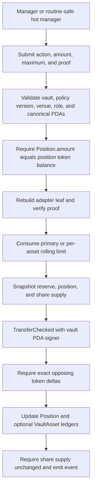

# Strategy Adapters

## Why adapters exist

A generic Merkle proof can authorize a CPI shape, but it cannot prove what that call means
economically. Value-moving strategy actions therefore need typed instructions that understand the
accounts, amount, and post-call accounting they are expected to enforce.

The first reference implementation is `manage_vault_with_token_balance_adapter`. It moves one
vault asset between the canonical reserve and canonical `Position` token account. It is deliberately
narrow: it demonstrates the adapter boundary and accounting invariants without claiming to model a
lending market, AMM, or other external protocol.

The generic `manage_vault_with_merkle_verification` path now rejects any writable SPL Token or
Token-2022 account whose token authority is the vault PDA. Read-only vault token accounts and
writable non-vault token accounts remain available to generic calls. This ensures vault custody can
only move through an instruction that reconciles its effects.

## Authorized leaf

Token-balance adapter leaves share the `StrategyPolicy` root and sorted-pair node format, but use a
separate leaf domain:

```text
adapter_leaf = SHA256(
    "async-vault-v2/token-balance-adapter-leaf/v1"
    || async_vault_program_id
    || vault
    || strategist
    || policy_version_le
    || venue_entry
    || vault_venue
    || token_program
    || action_tag
    || asset_mint
    || vault_token_account
    || position
    || position_token_account
    || policy_max_amount_le
)
```

`action_tag` is `0` for `Deploy` and `1` for `Pull`. The runtime `amount` is intentionally not
committed, allowing one leaf to authorize a bounded range of calls. The program requires
`0 < amount <= policy_max_amount`, and the declared maximum itself is proof-bound.

## Execution flow



Solana transaction atomicity rolls back the transfer, rolling-limit consumption, and ledger writes
if any proof, CPI, or post-transfer invariant fails.

## Accounting rules

| Asset path               | Rolling-limit bucket          | Required ledger updates                                                     |
| ------------------------ | ----------------------------- | --------------------------------------------------------------------------- |
| Primary asset            | `Vault.manager_window_*`      | `Position.amount`                                                           |
| Approved secondary asset | `VaultAsset.manager_window_*` | `Position.amount`, `VaultAsset.idle_balance`, `VaultAsset.deployed_balance` |

Both paths require the canonical reserve, `Position` PDA, and position-token PDA. Before movement,
the stored position amount must equal the actual position token balance. After movement, the reserve
and position balances must change by exactly the requested amount in opposite directions.

## Adding a protocol adapter

Each external protocol should receive a separate typed instruction and leaf domain. A production
adapter should:

1. Bind the vault, strategist, policy version, approved venue records, target program, action,
   market/reserve identities, asset mints, beneficiary/recipient accounts, and static risk bounds.
2. Keep only explicitly bounded values dynamic, such as `amount <= policy_max_amount` and
   slippage within a proof-bound limit.
3. Validate every canonical account owner, PDA, mint, authority, and protocol relationship before
   CPI.
4. Snapshot all economically relevant token and protocol-position state.
5. Set and flush the strategy-policy reentrancy guard before CPI.
6. Verify exact or conservatively bounded post-CPI deltas, require share supply unchanged, and then
   reconcile `Position` and `VaultAsset` accounting.
7. Include failure tests for substituted accounts, changed action/version/bounds, stale ledgers,
   over-limit calls, adverse Token-2022 extensions, reentrancy, and rollback.

The current token-balance adapter does not execute a lending, borrowing, swap, LP, or external
custody action. Those protocol-specific adapters, upgrade-aware venue validation, and oracle-backed
valuation remain separate features.
