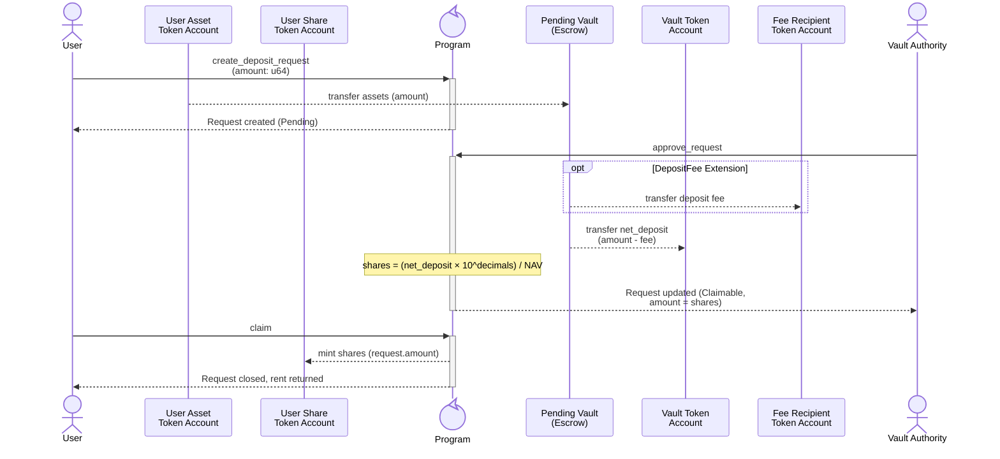
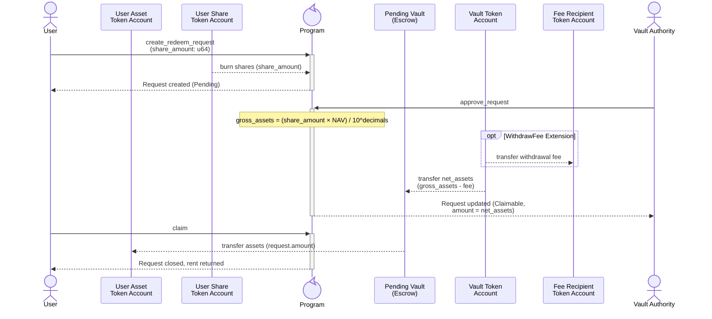
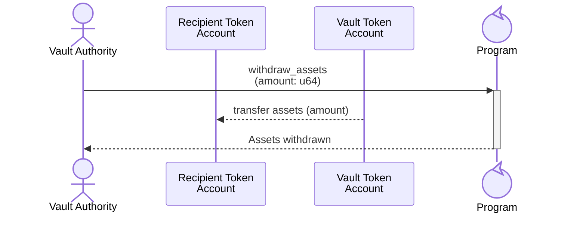

# async_vault_v2 Sequence Diagrams

## Deposit Approve

```mermaid
sequenceDiagram
    actor User
    participant UserAssetAcc as User Asset<br/>Token Account
    participant UserShareAcc as User Share<br/>Token Account
    participant Program@{ "type" : "control" }
    participant PendingVault as Pending Vault<br/>(Escrow)
    participant VaultTokenAcc as Vault Token<br/>Account
    participant FeeRecipient as Fee Recipient<br/>Token Account
    actor Authority as Vault Authority

    User->>+Program: create_deposit_request<br/>(amount: u64)
    UserAssetAcc-->>PendingVault: transfer assets (amount)
    Program-->>-User: Request created (Pending)

    Authority->>+Program: approve_request
    opt DepositFee Extension
        PendingVault-->>FeeRecipient: transfer deposit fee
    end
    PendingVault-->>VaultTokenAcc: transfer net_deposit<br/>(amount - fee)
    Note over Program: shares = (net_deposit × 10^decimals) / NAV
    Program-->>-Authority: Request updated (Claimable,<br/>amount = shares)

    User->>+Program: claim
    Program-->>UserShareAcc: mint shares (request.amount)
    Program-->>-User: Request closed, rent returned
```

## Redeem Approve

```mermaid
sequenceDiagram
    actor User
    participant UserAssetAcc as User Asset<br/>Token Account
    participant UserShareAcc as User Share<br/>Token Account
    participant Program@{ "type" : "control" }
    participant PendingVault as Pending Vault<br/>(Escrow)
    participant VaultTokenAcc as Vault Token<br/>Account
    participant FeeRecipient as Fee Recipient<br/>Token Account
    actor Authority as Vault Authority

    User->>+Program: create_redeem_request<br/>(share_amount: u64)
    UserShareAcc-->>Program: burn shares (share_amount)
    Program-->>-User: Request created (Pending)

    Authority->>+Program: approve_request
    Note over Program: gross_assets = (share_amount × NAV) / 10^decimals
    opt WithdrawFee Extension
        VaultTokenAcc-->>FeeRecipient: transfer withdrawal fee
    end
    VaultTokenAcc-->>PendingVault: transfer net_assets<br/>(gross_assets - fee)
    Program-->>-Authority: Request updated (Claimable,<br/>amount = net_assets)

    User->>+Program: claim
    PendingVault-->>UserAssetAcc: transfer assets (request.amount)
    Program-->>-User: Request closed, rent returned
```

## Authority Withdraw

```mermaid
sequenceDiagram
    actor Authority as Vault Authority
    participant RecipientAcc as Recipient Token<br/>Account
    participant VaultTokenAcc as Vault Token<br/>Account
    participant Program@{ "type" : "control" }

    Authority->>+Program: withdraw_assets<br/>(amount: u64)
    VaultTokenAcc-->>RecipientAcc: transfer assets (amount)
    Program-->>-Authority: Assets withdrawn
```
